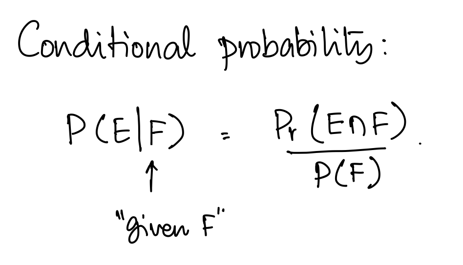
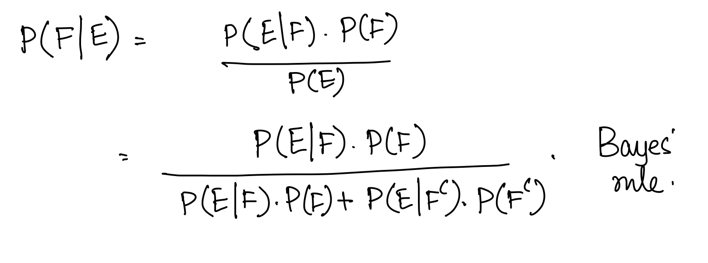
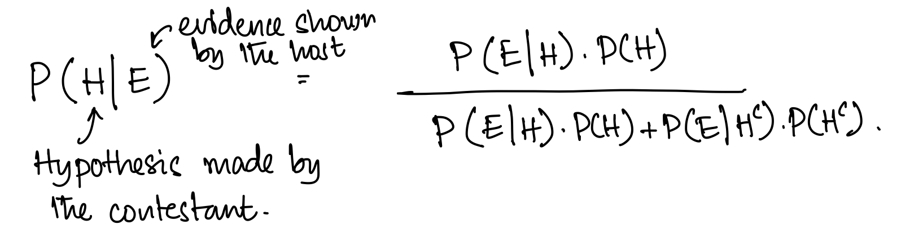
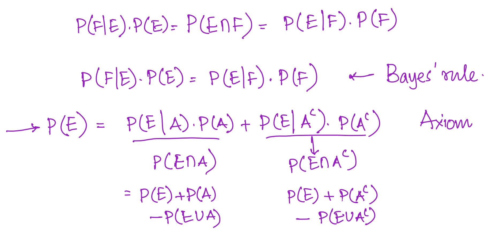

# Bayes theorem

imp wuestion
Q1. It is estimated that half of all mails are spam. A software has been applied to filter these spam emails before they reach your inbox. A certain brand of software claims that it can detect 99% of spam emails, and the probability for a false positive (a non-spam email detected as spam) is 5%. Now if an email is detected as spam, then what is the probability that it is in fact a non-spam email?

