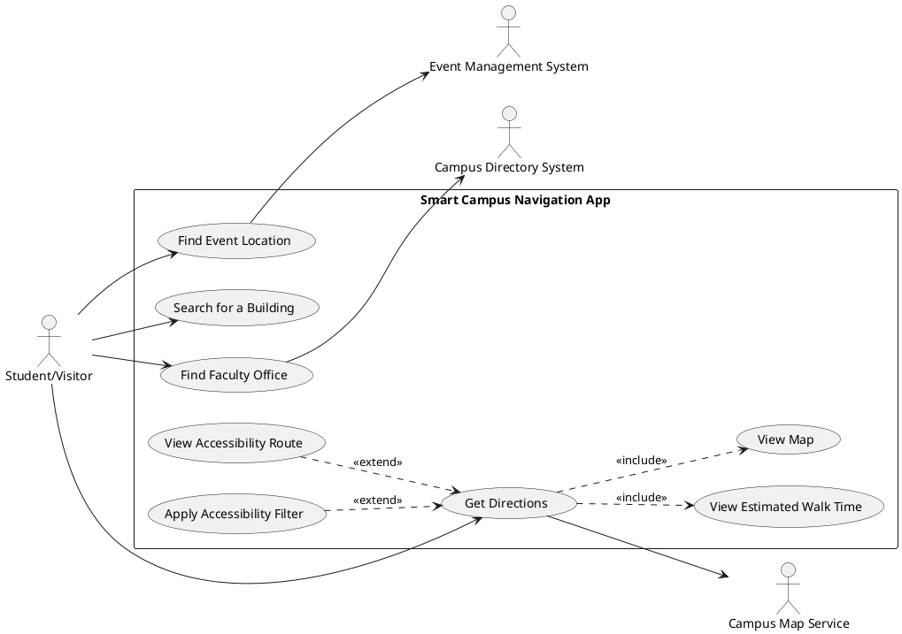
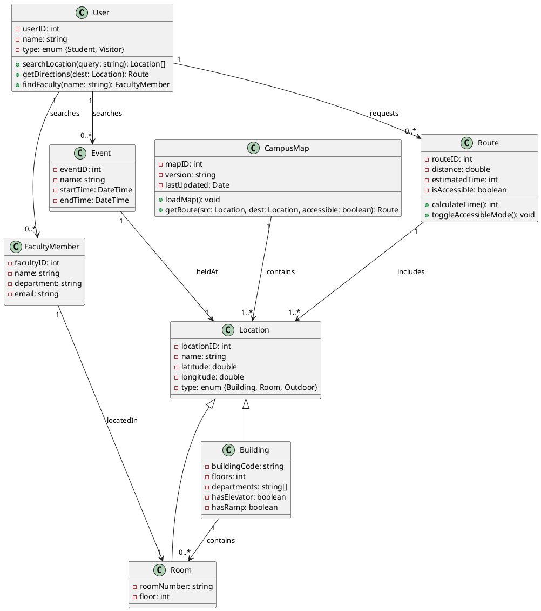
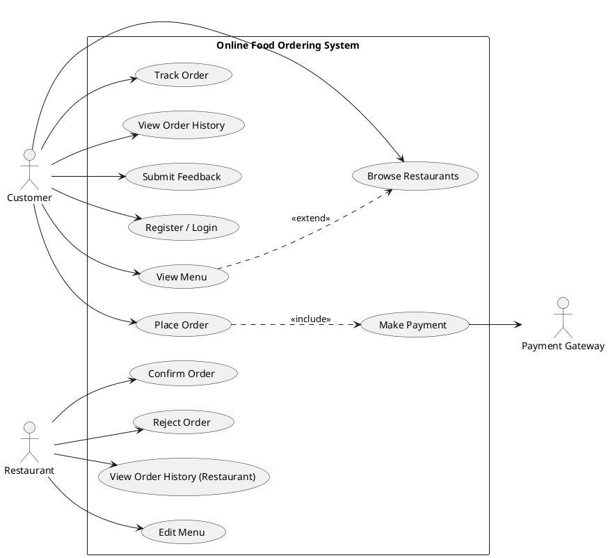
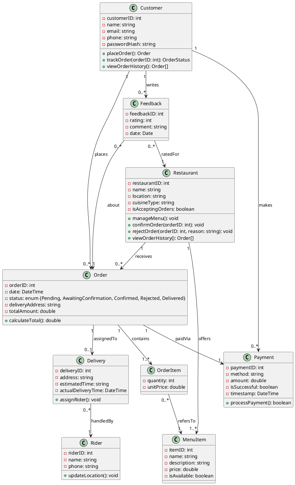

# Software Systems — Assignment 2
**Name:** Abhay Chaturvedi  
**Roll Number:** MSc-DS-2025-10-0041

---

# Part A — Model Creation Task: Smart Campus Navigation App

## Task 1: Use Case Diagram

```
+----------------------------------------------------------+
|              Smart Campus Navigation App                  |
|                                                          |
|   [Search for a Building]                                |
|   [Get Directions]          <<include>>  [View Map]      |
|   [Find Faculty Office]                                  |
|   [Find Event Location]     <<extend>>   [Filter by     |
|   [View Accessibility Route]              Accessibility] |
|   [View Estimated Walk Time]                             |
|                                                          |
+----------------------------------------------------------+
       |
   (Student / Visitor)
       |
   [Search for a Building]
   [Get Directions] --------<<include>>-----> [View Map]
   [Find Faculty Office]
   [Find Event Location]
   [View Accessibility Route] <<extend>> [Get Directions]
   [View Estimated Walk Time] <<include>> [Get Directions]

External Systems:
   [Campus Directory System] <-- [Find Faculty Office]
   [Campus Map Service]      <-- [Get Directions]
   [Event Management System] <-- [Find Event Location]
```

### Use Case Diagram (PlantUML notation)



---

## Task 2: Detailed Use Cases

---

### Use Case 1: Search for a Building

| Element | Description |
|---|---|
| **Use Case ID** | UC-01 |
| **Use Case Name** | Search for a Building |
| **Actors** | Student / Visitor (primary) |
| **Preconditions** | App is launched and campus map is loaded. User has internet or offline map data. |
| **Main Flow** | 1. User opens the Search bar. <br> 2. User types the building name or code (e.g., "Vindhya", "AB1"). <br> 3. System queries the campus location database. <br> 4. System displays a ranked list of matching buildings with a brief description and location pin on the map. <br> 5. User selects a building from the results. <br> 6. System highlights the selected building on the map and shows details (name, departments, floors, entrance). |
| **Alternative Flow A** | (3a) If the search term matches no building: System displays "No buildings found. Try a different keyword." User may refine the query. |
| **Alternative Flow B** | (2b) If the user searches by department or faculty name: System resolves the department to its host building and displays that building. |
| **Exception Flow** | (3e) If the location database is unavailable: System displays cached results if available, otherwise shows "Service temporarily unavailable." |
| **Postconditions** | The requested building is highlighted on the map. The user can optionally proceed to "Get Directions." |

---

### Use Case 2: Get Directions

| Element | Description |
|---|---|
| **Use Case ID** | UC-02 |
| **Use Case Name** | Get Directions |
| **Actors** | Student / Visitor (primary); Campus Map Service (secondary, external) |
| **Preconditions** | User has selected a destination (building, office, or event venue). App has access to the user's current location (GPS or manual entry). |
| **Main Flow** | 1. User selects "Get Directions" from a building or location detail page. <br> 2. System reads the user's current GPS location. <br> 3. System queries the Campus Map Service for the shortest walkable path from source to destination. <br> 4. System displays the route on the map with step-by-step walking instructions. <br> 5. System displays the estimated walking time (e.g., "~7 min"). <br> 6. User follows the highlighted route on the map. |
| **Alternative Flow A** | (2a) If GPS is unavailable: System prompts the user to manually enter a starting location (building name or current location pin). |
| **Alternative Flow B** | (3b) If the user has requested an accessibility-friendly route: System filters paths to include only ramps, elevators, and step-free walkways and recomputes the route. |
| **Alternative Flow C** | (4c) User can toggle between "Shortest Route" and "Accessible Route" after directions are displayed. |
| **Exception Flow** | (3e) If no walkable path exists between source and destination: System shows "No direct route found. Please check for road closures or construction." |
| **Postconditions** | An active navigation route is displayed. Estimated time and distance are shown. User's journey is tracked step-by-step until they reach the destination or cancel navigation. |

---

### Use Case 3: Find Faculty Office

| Element | Description |
|---|---|
| **Use Case ID** | UC-03 |
| **Use Case Name** | Find Faculty Office |
| **Actors** | Student / Visitor (primary); Campus Directory System (secondary, external) |
| **Preconditions** | App is launched. Campus Directory System is accessible. |
| **Main Flow** | 1. User navigates to "Find Faculty" section. <br> 2. User enters the faculty member's name or department. <br> 3. System queries the Campus Directory System for the faculty's office details. <br> 4. System displays the faculty member's name, department, building, floor, and room number. <br> 5. User selects "Get Directions to Office." <br> 6. System invokes UC-02 (Get Directions) with the office room as the destination. |
| **Alternative Flow A** | (3a) If multiple faculty members match the search (e.g., same last name): System presents a list with department affiliations; user selects the correct one. |
| **Alternative Flow B** | (3b) If the faculty member is not found in the directory: System shows "Faculty member not found. Please verify the name or contact your department." |
| **Exception Flow** | (3e) If the Campus Directory System is offline: System shows "Directory service is currently unavailable. Please try again later." Cached records, if present, are shown with a "last updated" timestamp. |
| **Postconditions** | The faculty office location is displayed on the map. User can optionally initiate navigation to the office. |

---

## Task 3: Requirements Model (Class Diagram)

```
+-------------------+          +------------------+
|      User         |          |    CampusMap     |
+-------------------+          +------------------+
| - userID: int     |          | - mapID: int     |
| - name: string    |          | - version: string|
| - type: enum      |  uses    | - lastUpdated:   |
|   {Student,       |--------->|   Date           |
|    Visitor}       |          +------------------+
| + searchLocation()|          | + loadMap()      |
| + getDirections() |          | + getRoute()     |
| + findFaculty()   |          +------------------+
+-------------------+                 |
        |                         contains (1..*)
        | requests (0..*)              |
        v                             v
+-------------------+          +------------------+
|      Route        |          |    Location      |
+-------------------+          +------------------+
| - routeID: int    | includes | - locationID: int|
| - distance: double|--------->| - name: string   |
| - estTime: int    | (1..*)   | - latitude: double|
| - isAccessible:   |          | - longitude:double|
|   boolean         |          | - type: enum     |
| + calculateTime() |          |   {Building,     |
| + toggleAccessible|          |    Room, Outdoor}|
+-------------------+          +------------------+
                                       ^
                                    (is-a)
                     __________________|___________________
                    |                                      |
        +-------------------+              +------------------+
        |     Building      |              |      Room        |
        +-------------------+              +------------------+
        | - buildingCode:   |              | - roomNumber:    |
        |   string          |   contains   |   string         |
        | - floors: int     |<-------------|  (0..*)          |
        | - departments:    |              | - floor: int     |
        |   string[]        |              | - hasElevator:   |
        | - hasElevator:    |              |   boolean        |
        |   boolean         |              +------------------+
        | - hasRamp:boolean |
        +-------------------+
                 ^
                 | locatedIn
                 |
        +-------------------+         +-------------------+
        |  FacultyMember    |         |      Event        |
        +-------------------+         +-------------------+
        | - facultyID: int  |         | - eventID: int    |
        | - name: string    |         | - name: string    |
        | - department:     |         | - startTime:      |
        |   string          |         |   DateTime        |
        | - officeRoom: Room|         | - endTime:DateTime|
        | - email: string   |         | - venue: Location |
        +-------------------+         +-------------------+
```

### Class Diagram (PlantUML notation)



---
---

# Part B — Model Correction Task: Online Food Ordering System

## Identified Mistakes, Missing Cases, and Ambiguities

### Mistakes in the Use Case Diagram

1. **Wrong direction of `extends` relationship**: The diagram shows `View Restaurants --extends--> View Menu`. In UML, the extending use case points to the base use case. "View Menu" is the specialised extension of "View Restaurants", so the arrow should be from `View Menu` to `View Restaurants`. Additionally, this should be `<<extend>>` not `<<extends>>`.

2. **Customer connected to `Edit Menu`**: In the original diagram, the `Customer` actor appears to be connected to "Edit Menu". Customers cannot edit restaurant menus — only `Restaurant` should own this use case.

3. **Missing actor connections**: The `Restaurant` actor is not connected to "Confirm/Reject Order" in the diagram, even though Use Case 4 describes it. This use case is absent from the diagram entirely.

4. **Missing use cases in diagram**: The diagram omits: `Login/Register`, `View Order History` (described in system requirements), and `Reject Order` (mentioned in requirements but not in any diagram or use case table).

5. **`Payment Gateway` as an actor connected to `Place Order`**: The diagram appears to draw `Payment Gateway` as participating in `Place Order` directly, but it should only participate in `Make Payment`.

### Mistakes in the Detailed Use Cases

1. **UC1 — Wrong postcondition**: "System saves the filtered list for future sessions" is functionally wrong. Filters are session-specific preferences and do not need to be persisted. The correct postcondition is that the filtered list is displayed to the user.

2. **UC1 — Overly restrictive precondition**: Browsing restaurants should not require login. Viewing restaurants and menus is typically a public feature; login is required only at order placement.

3. **UC2 — Wrong main flow (Restaurant as real-time uploader)**: The main flow states "Restaurant uploads the latest menu file" every time a customer views the menu. This is incorrect — the menu is pre-stored in the system database. The Restaurant actor only updates the menu via a separate `Edit Menu` use case.

4. **UC3 — Wrong precondition for payment**: "Order placed but not confirmed by restaurant" — payment typically happens after order placement and before or alongside restaurant confirmation. Making payment depend on the restaurant NOT confirming is logically inconsistent.

5. **UC4 — Missing alternate flow**: The "Confirm Order" use case has no alternate flow for rejection. Since the system requirements explicitly state that restaurants can reject orders, a rejection path and its consequences (e.g., notifying the customer, refunding payment) must be modelled.

### Mistakes in the Class Diagram

1. **Missing `Customer → Order` association**: There is no direct link between `Customer` and `Order`. The `places` label on the left side is ambiguous and appears to come from the wrong end. `Customer` must have a direct `places` (1 to many) relationship with `Order`.

2. **`Payment` linked to `Customer` via `madeBy` with wrong multiplicity**: The diagram implies a 1-to-1 between Customer and Payment. In reality, a Customer makes many payments over time (one per order). The relationship should be `Customer (1) --> (*) Payment`.

3. **`Feedback` not linked to `Order`**: `Feedback` is linked to `Restaurant` (via "about") but not to `Order`. Feedback is given about a specific order experience. The association `Feedback --> Order` is missing.

4. **`Order` class missing `Customer` link**: `Order` has no foreign key or association back to `Customer`, making it impossible to know who placed an order.

5. **`Restaurant --places--> something`**: The `places` label on the left side of the diagram is ambiguous — it seems to be placed on the Restaurant-to-MenuItem or Restaurant-to-Order edge incorrectly. Only `Customer` places orders.

6. **`Rider` exists in class diagram but not in Use Case diagram or use case descriptions**: Rider has no corresponding use case (e.g., "Assign Rider", "Track Delivery"), creating an orphan class with no system behaviour defined.

---

## Corrected Use Case Diagram



---

## Corrected Detailed Use Cases

---

### Use Case 1: Browse Restaurants

| Element | Description |
|---|---|
| **Actors** | Customer |
| **Preconditions** | App is open. No login required for browsing. |
| **Main Flow** | 1. Customer opens "Browse Restaurants" page. <br> 2. System fetches and displays a list of available restaurants from the database. <br> 3. Customer optionally applies filters (cuisine type, price range, rating). <br> 4. System updates and displays the filtered results. <br> 5. Customer selects a restaurant to view its menu. |
| **Alternative Flow A** | (4a) If no restaurants match the filter: System displays "No Results Found. Try adjusting your filters." |
| **Exception Flow** | (2e) If the system cannot fetch restaurant data (network error): System displays a cached list (if available) with a stale-data warning, or shows an error message. |
| **Postconditions** | A list of matching restaurants is displayed. Customer can proceed to view a menu. |

---

### Use Case 2: View Menu

| Element | Description |
|---|---|
| **Actors** | Customer |
| **Preconditions** | Customer has selected a restaurant from the browse page. |
| **Main Flow** | 1. Customer clicks on a restaurant. <br> 2. System retrieves the restaurant's current menu from the database. <br> 3. System displays menu items with name, description, price, and availability. <br> 4. Customer browses items and can add them to cart. |
| **Alternative Flow A** | (2a) If the restaurant has temporarily disabled ordering: System shows the menu in read-only mode with the message "This restaurant is not accepting orders right now." |
| **Exception Flow** | (2e) If the menu data is unavailable: System shows "Menu not available at the moment. Please try again later." |
| **Postconditions** | The restaurant's menu is displayed. Customer can add items to cart to proceed with ordering. |

---

### Use Case 3: Place Order

| Element | Description |
|---|---|
| **Actors** | Customer |
| **Preconditions** | Customer is logged in. Customer has at least one item in the cart. |
| **Main Flow** | 1. Customer reviews items in cart. <br> 2. Customer enters or confirms delivery address. <br> 3. Customer clicks "Place Order." <br> 4. System creates an order record with status "Pending." <br> 5. System invokes **Make Payment** (UC4). <br> 6. Upon payment success, system notifies the Restaurant of the new order. <br> 7. System displays order confirmation with order ID and estimated delivery time. |
| **Alternative Flow A** | (2a) If delivery address is outside the restaurant's delivery zone: System shows "Delivery not available to your area." |
| **Alternative Flow B** | (5b) If payment fails: System retains the cart and prompts the customer to retry payment or choose another method. Order remains in "Pending" state. |
| **Exception Flow** | (3e) If a selected item becomes unavailable after cart creation: System alerts the customer and removes the item from the cart before proceeding. |
| **Postconditions** | An order record is created with status "Pending Payment" or "Awaiting Confirmation." The Restaurant is notified. |

---

### Use Case 4: Make Payment

| Element | Description |
|---|---|
| **Actors** | Customer (primary); Payment Gateway (secondary) |
| **Preconditions** | Customer has placed an order. Order status is "Pending Payment." |
| **Main Flow** | 1. System presents payment options (credit/debit card, UPI, wallet). <br> 2. Customer selects a payment method and enters credentials. <br> 3. System securely redirects the transaction to the Payment Gateway. <br> 4. Payment Gateway processes and authorises the payment. <br> 5. Payment Gateway returns success response to the system. <br> 6. System records payment details and updates order status to "Paid / Awaiting Confirmation." |
| **Alternative Flow A** | (4a) If payment authorisation fails: System displays "Payment failed. Please try again or use a different method." Order remains in "Pending Payment" state. |
| **Alternative Flow B** | (4b) If customer abandons payment: Order is retained in "Pending Payment" state for a configurable timeout period, after which it is auto-cancelled. |
| **Postconditions** | Payment is recorded. Order status updated to "Awaiting Confirmation." Restaurant receives the confirmed order. |

---

### Use Case 5: Confirm Order (Restaurant)

| Element | Description |
|---|---|
| **Actors** | Restaurant |
| **Preconditions** | An order exists with status "Awaiting Confirmation." Payment has been successfully received. |
| **Main Flow** | 1. Restaurant receives a notification of the new order. <br> 2. Restaurant reviews order details (items, quantity, delivery address). <br> 3. Restaurant clicks "Confirm." <br> 4. System updates order status to "Confirmed." <br> 5. System notifies the Customer that their order has been confirmed and provides an estimated delivery time. |
| **Alternative Flow A** | (3a) Restaurant clicks "Reject" (see UC6 — Reject Order). |
| **Postconditions** | Order status is "Confirmed." Customer is notified. Preparation begins. |

---

### Use Case 6: Reject Order (Restaurant)

| Element | Description |
|---|---|
| **Actors** | Restaurant |
| **Preconditions** | An order exists with status "Awaiting Confirmation." |
| **Main Flow** | 1. Restaurant reviews the order. <br> 2. Restaurant selects a rejection reason (e.g., "Item unavailable", "Restaurant closing early"). <br> 3. Restaurant clicks "Reject." <br> 4. System updates order status to "Rejected." <br> 5. System notifies Customer with the rejection reason. <br> 6. System initiates a full refund to the Customer via the Payment Gateway. |
| **Postconditions** | Order is cancelled. Customer is notified and refunded. |

---

## Corrected Class Diagram



---

## Corrections Summary

### Use Case Diagram — Corrections Made

- **Corrected `extends` direction**: Changed from `View Restaurants --extends--> View Menu` to `View Menu --<<extend>>--> Browse Restaurants`. In UML, the extending use case carries the arrow to the base use case.
- **Removed Customer from Edit Menu**: Customers do not edit restaurant menus. `Edit Menu` is exclusively a `Restaurant` use case.
- **Added missing use cases**: Added `Register/Login`, `View Order History` (both Customer and Restaurant sides), `Reject Order`, and `Submit Feedback` — all required by the system description.
- **Separated `Confirm` and `Reject` Order**: These are two distinct use cases with different postconditions (especially regarding refunds) and should be modelled separately.
- **Corrected Payment Gateway scope**: Payment Gateway only participates in `Make Payment`, not `Place Order`.

### Use Case Descriptions — Corrections Made

- **UC1 postcondition fixed**: Removed "system saves filtered list for future sessions" — filters are ephemeral UI state, not persistent data.
- **UC1 precondition relaxed**: Browsing restaurants does not require login. Login is enforced at order placement.
- **UC2 main flow corrected**: Removed the incorrect step where "Restaurant uploads menu file on every view." The menu is pre-stored in the system; Restaurant updates it separately.
- **UC3 payment precondition corrected**: Payment now occurs after order creation, not before restaurant confirmation. The original precondition was logically reversed.
- **UC5/UC6 added alternate and exception flows**: Added rejection flow with notification and refund steps, which were completely absent from the original UC4.

### Class Diagram — Corrections Made

- **Added `Customer → Order` (places) association**: The original diagram had no direct link between Customer and Order, making it impossible to trace who owns an order.
- **Added `Order → Feedback` association**: Feedback is about a specific order experience; linking only to Restaurant was incomplete.
- **Fixed `Customer → Payment` multiplicity**: Changed to 1-to-many (one customer, many payments over time) and gave it a clear `makes` label.
- **Renamed `password` to `passwordHash`**: Storing plain-text passwords is a security violation. Renamed to reflect that passwords are stored hashed.
- **Added `OrderItem` as association class**: A direct many-to-many between `Order` and `MenuItem` without an intermediary loses quantity and unit price data. `OrderItem` captures these.
- **Kept `Rider` but linked to `Delivery` with a use case**: Added `Delivery` tracking use case context and linked Rider to Delivery properly, rather than leaving Rider as an orphan class.
